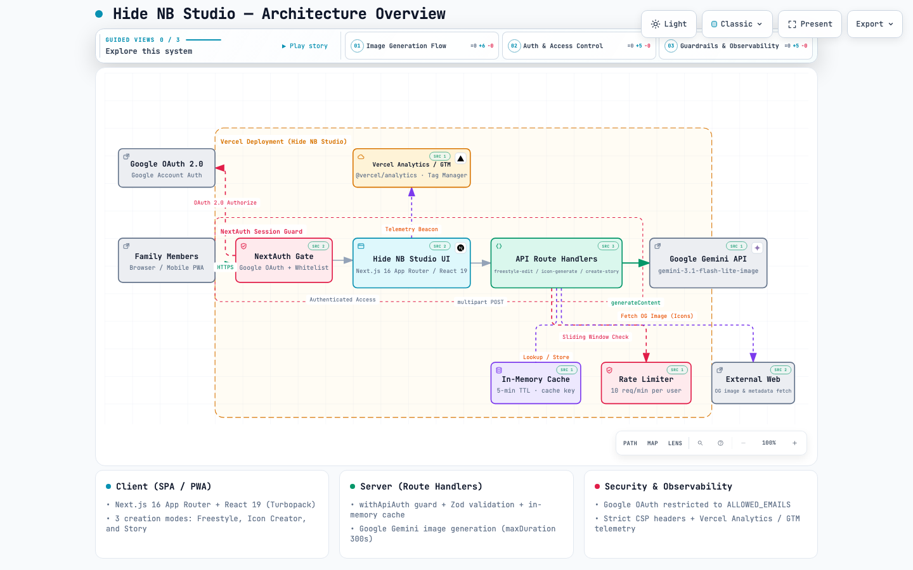

# Hide NB Studio

Family-only image editing studio built with Next.js and Google Gemini. It authenticates with Google accounts that you explicitly allow, converts uploaded photos with curated prompt presets — freestyle edits, contact icons, and illustrated family stories — keeps every generated result in a browser-local gallery, and captures traffic metrics via Vercel Web Analytics.

## Features

- Google OAuth login restricted to whitelisted email addresses
- Three creation modes, switchable from the dock: Freestyle, Icon Creator, and Story
- Guided image editing using Gemini API and preset creative prompts
- Story mode turns uploaded photos into a picture book, a four-panel comic, or a family newspaper, with a selectable tone (funny / cute / adventure / warm), output language (Japanese / English), and an optional custom prompt
- One-click preview/reset workflow for uploading and generating results
- Browser-local gallery for every generated result, backed by IndexedDB, with preview, copy, download, and delete
- Built-in observability with `@vercel/analytics`
- Health probe at `GET /api/health`
- Ready for Vercel deployment with App Router, TypeScript, and NextAuth

## Tech Stack

- Next.js 16 (App Router, Turbopack) & React 19
- TypeScript
- NextAuth (Google provider)
- Google Gemini API (via `@google/genai`)
- Serwist (PWA service worker)
- Vercel Analytics

## Architecture Overview

- `src/app` contains App Router routes, layouts, and page UI; `src/app/page.tsx` owns the active mode and renders the matching editor.
- `src/app/api` holds route handlers for image editing, icon generation, story creation, health checking, and authentication.
- `src/components/layout` houses layout primitives (shell, dock, editor frame), `src/components/features/editor` holds the three creation modes (`FreestyleEditor`, `IconCreator`, `StoryCreator`), `src/components/features/gallery` holds `GalleryModal`, and `src/components/ui` keeps reusable controls.
- `src/hooks` contains the hooks the three editors share: submit, upload slots, progress simulation, recent prompts, result history, and text undo/redo.
- `src/utils` includes shared helpers, with `src/utils/server` reserved for server-only logic. The client-side gallery lives in `src/utils/galleryStorage.ts`, and `src/utils/server/storyPromptBuilder.ts` builds the story prompts.
- `src/auth.ts` configures NextAuth, `src/proxy.ts` (the Next.js proxy, formerly the middleware convention) guards every route except the login page and static assets, and `src/utils/promptConstants.ts` defines shared prompt constants.

## Architecture Diagram

Interactive, project-wide architecture overview generated by [Archify](https://github.com/tt-a1i/archify) from the checked-in specification `docs/architecture/hide-nb-studio.architecture.json` (see `meta.repository` and the `sources` on each node for file-level evidence).

- [▶ Open Interactive Diagram (GitHub Pages)](https://hidenobunagai.github.io/nano-banana-family/architecture/hide-nb-studio.html)
- [▶ Open Local HTML](docs/architecture/hide-nb-studio.html) (theme switching, pan/zoom, search, guided views: Image Generation Flow / Auth & Access Control / Guardrails & Observability)



> The specification and the interactive HTML were regenerated on 2026-09-17 against revision `f6c25a2`, which added the browser gallery and story nodes and dropped the rate limiter that no longer exists. The screenshots below still come from the 2026-08-31 render, so treat the interactive HTML (not the image) as the current architecture.

## API Routes

The three generation routes are `POST` multipart handlers on the Node.js runtime. They all require an authenticated session (`src/utils/server/withApiAuth.ts`), validate their fields with Zod (`src/utils/server/validation.ts`), share the in-memory generation cache (`src/utils/server/cache.ts`), and declare `maxDuration = 300` so a slow Gemini render is not cut off.

- `POST /api/freestyle-edit` edits up to five uploaded images based on a freeform prompt.
- `POST /api/icon-generate` generates contact icons from up to three uploaded images plus name, style, and an optional custom prompt, enriching the prompt with the supplied URL's metadata and OG image when that page exposes one.
- `POST /api/create-story` renders a picture book (`picture-book`), four-panel comic (`comic`), or family newspaper (`newspaper`) from up to five uploaded photos, driven by `storyType`, `tone`, `language`, and an optional `customPrompt`.
- `GET /api/health` returns a liveness payload (`{ "status": "ok", "timestamp": "<ISO 8601>" }`). It is not exempt from `src/proxy.ts`, so it sits behind the NextAuth session check like every other non-static route.
- `GET|POST /api/auth/*` handles NextAuth Google sign-in.

## Getting Started

### 1. Clone and install

```bash
bun install
```

### 2. Configure environment variables

Local development now uses `dotenvx` with the Next.js env-file convention. Vercel can continue using its dashboard-managed environment variables; no Vercel-side `dotenvx` setup is required for this repository.

The app expects:

| Variable                           | Description                                                     |
| ---------------------------------- | --------------------------------------------------------------- |
| `AUTH_SECRET` or `NEXTAUTH_SECRET` | NextAuth secret (`openssl rand -base64 32`)                     |
| `AUTH_GOOGLE_ID`                   | Google OAuth client ID                                          |
| `AUTH_GOOGLE_SECRET`               | Google OAuth client secret                                      |
| `ALLOWED_EMAILS`                   | Comma-separated list of emails allowed to sign in               |
| `GEMINI_API_KEY`                   | Google Gemini API key                                           |
| `GEMINI_IMAGE_MODEL`               | Optional model override (default `gemini-3.1-flash-lite-image`) |

Set up local secrets with `dotenvx`:

```bash
cp .env.example .env.local
```

Fill in the values in `.env.local`, then encrypt it:

```bash
bun run env:encrypt
```

This encrypts `.env.local` in place and stores the private key in `.env.keys`. Keep `.env.keys` local only.

To inspect which env files `dotenvx` sees:

```bash
bun run env:ls
```

> Tip: When deploying on Vercel, keep using **Project Settings -> Environment Variables**. The bundled scripts ignore missing local env files, so Vercel can keep relying on dashboard-managed secrets.

### 3. Run locally

```bash
bun run dev
```

Visit <http://localhost:3001> and sign in with an allowed Google account to try the studio.

## Quality Checks

```bash
bun run lint
bun run typecheck
bun run test
bun run test:coverage
bun run format
```

TypeScript runs in a hybrid setup: the `typescript` package (6.x, JS API) drives `next build` and ESLint, while `@typescript/native` (7.x, the native compiler) backs the `tsc` binary for fast type checking.

## Prompt Presets

The editor ships with several ready-made prompts, including:

- Pirate wanted poster (aged parchment style)
- Martial arts action scene with arcade HUD
- Passport-style ID photo (blue background)
- Monochrome manga line art conversion
- Superhero comic strip storytelling

Story mode carries its own presets instead of freeform prompts: picture book, four-panel comic, and family newspaper, each combined with the funny / cute / adventure / warm tones and the Japanese or English output language.

You can customize style presets in `src/utils/server/stylePrompts.ts`, story wording in `src/utils/server/storyPromptBuilder.ts`, and shared prompt constants in `src/utils/promptConstants.ts`.

## Deployment

The repository is configured for Vercel hosting. After setting environment variables, push to GitHub and run:

```bash
vercel --prod
```

or connect the GitHub repo in the Vercel dashboard for automatic deployments. Analytics widgets will start reporting once production traffic arrives.

## Security & Privacy

- No production secrets are stored in this repository; verify environment variables before making the repo public.
- Rotate any keys that may have been exposed previously.
- Google sign-in allows access only to addresses listed in `ALLOWED_EMAILS`.

## Progressive Web App

- Install the app on iOS or Android from the browser share/install menu. The web app manifest is served from `src/app/manifest.ts` and the service worker is compiled by Serwist (`@serwist/turbopack`) and served from `/serwist/sw.js`.
- Service worker registration is disabled during local development (`next dev`); run `bun run build && bun run start` to test the PWA locally over HTTPS.
- Generated assets (`public/sw.js`, `public/workbox-*.js`) are ignored by Git and created during `next build`.

## Local Gallery

- Every result from all three modes is saved to IndexedDB (`hide-nb-studio-gallery` → `artworks`), so the gallery is per-browser and per-device: it is never uploaded to the server and does not follow you to another device.
- Only the newest 50 items are kept; older entries are pruned on each save.
- Where IndexedDB is unavailable, `src/utils/galleryStorage.ts` falls back to an in-memory store, so items survive only until the page reloads.
- A failed IndexedDB write returns `null` and the UI shows an error toast instead of silently pretending the artwork was stored. Clearing site data deletes the gallery.
